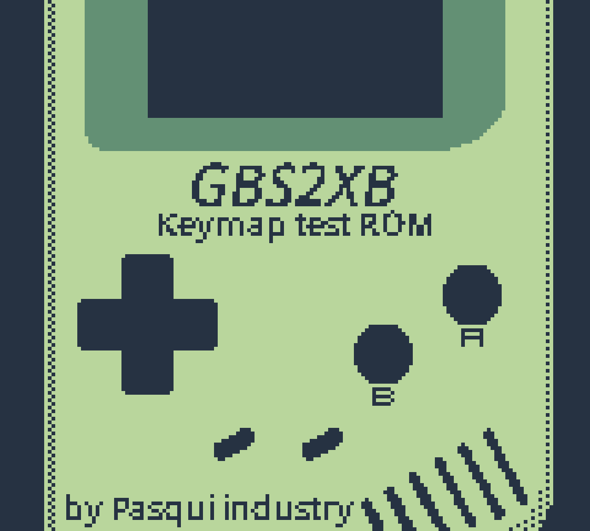
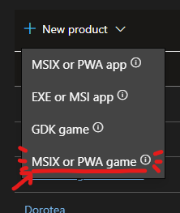
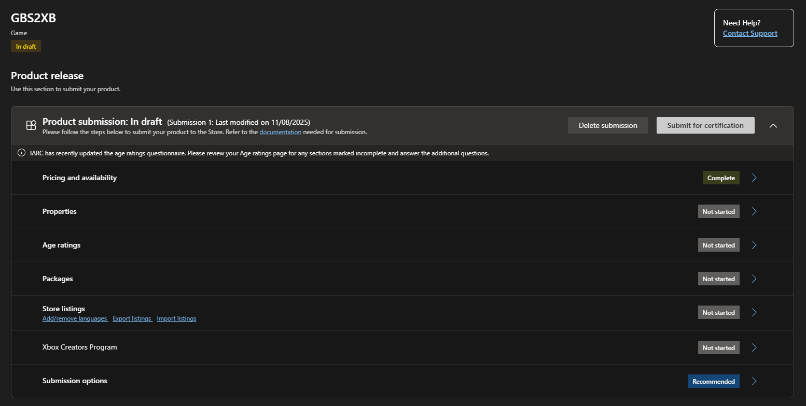
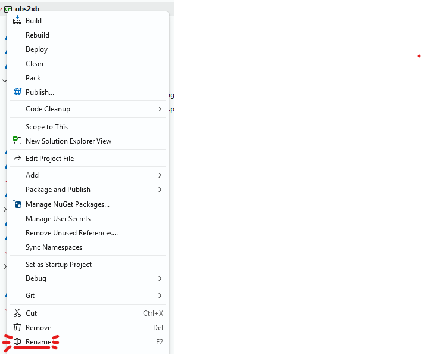
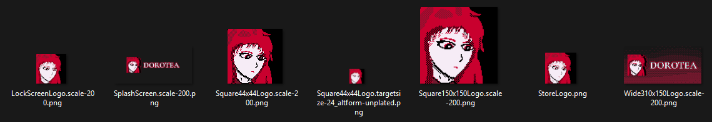
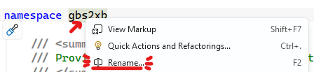
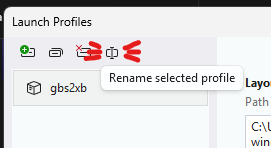
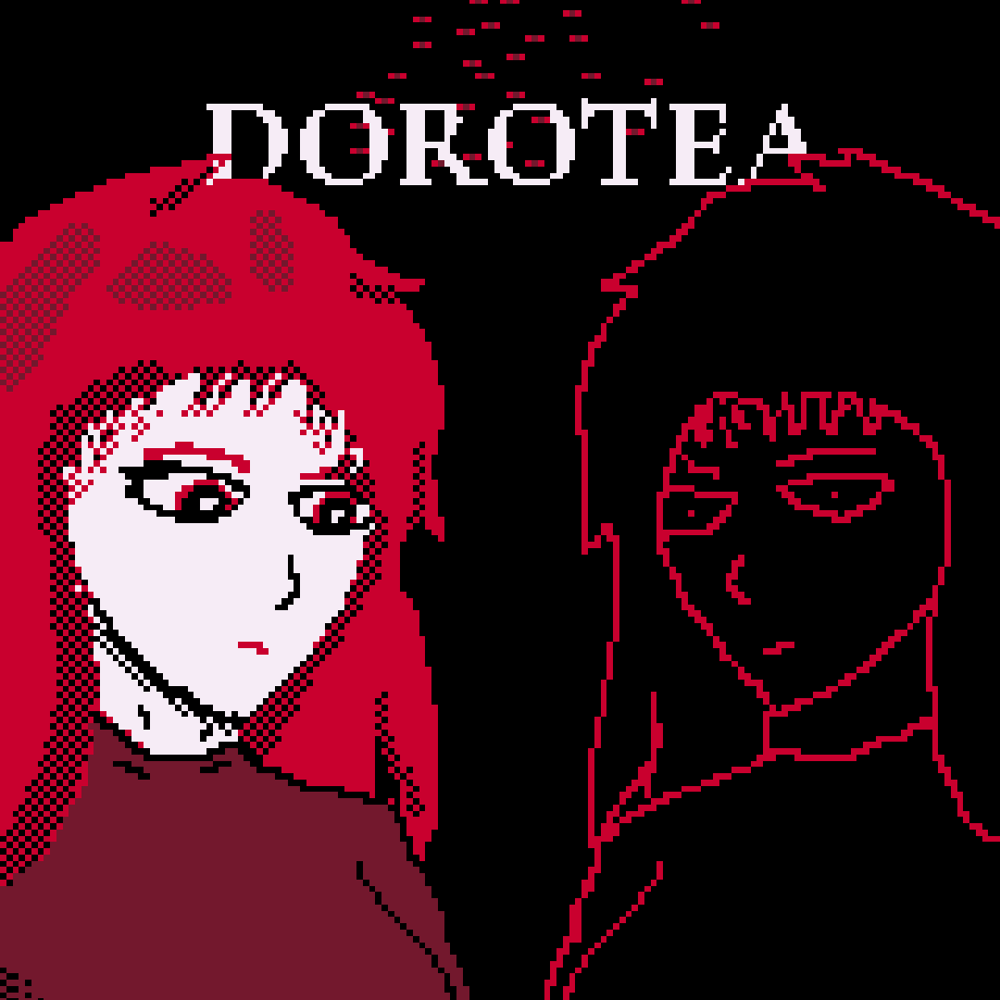
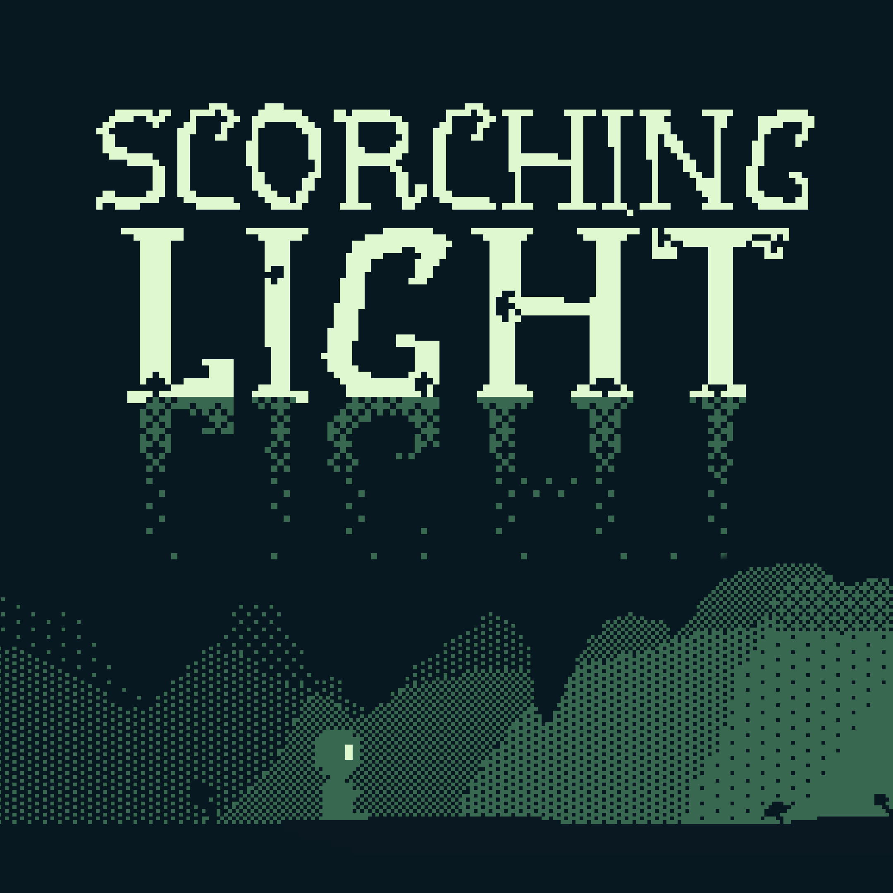

# GBS2XB

Ciao! __GBS2XB__ Is a project you can use to help release your __Game Boy__ game to the Microsoft Store, including __Windows / Xbox PC__, __Xbox One__ and __Xbox Series__ consoles, especially if made with [GB Studio](https://www.gbstudio.dev/).

You can also distribute __any Game Boy or Game Boy Color game__, even the ones made without GB Studio, but you may need to provide your HTML5/JS emulator and adapt the code, since there are some optimizations tailored to Binjgb, the web emulator provided by GB Studio.

# Table of Contents
- [Included Sample ROM](#included-sample-rom)
- [Prerequisites](#prerequisites)
	- [Hardware](#hardware) 
	- [Software and assets](#software-and-assets) 
	- [Name reservation and the Microsoft Partner Center](#name-reservation-and-the-microsoft-partner-center)
- [Create and customize your project
](#create-and-customize-your-project)
	- [Steps from cloning to release](#steps-from-cloning-to-release)
	- [Add your game to the Solution](#add-your-game-to-the-solution)
	- [Code changes](#code-changes)
- [Which improvements I made](#which-improvements-i-made)
- [Known Issues](#known-issues)
- [FAQ](#faq)
- [Games that uses this project](#games-that-uses-this-project)
	- [Dorotea](#dorotea)
	- [Scorching Light](#scorching-light)

## Included Sample ROM
 
To test things quickly, I included a sample project I made, including the Game Boy ROM and the emulator Binjgb provided by GB Studio. With this ROM you can test all the Game Boy keys and check if everything is working as expected. 

You'll remove it once you're ready to add your own game.
These files are all in the __📁Game__ directory of this project.

## Prerequisites

### Hardware
- Just a decent PC should be enough. You may need a lot of free GBs for Visual Studio
- Since you're probably releasing your game on Xbox One or Xbox Series X|S, you may need a console. It doesn't matter if you have the oldest Xbox One or the newest Series X: they share the same OS. I'm not sure, but I don't think it's mandatory to have one, since you can test the same package on your Windows machine too. 

### Software and assets
- __Install Visual Studio 2026__. GBS2XB is an __Universal Windows App__ project (UWP, ex WinUi 2), uses __c#, XAML, JS__ and __.NET 10__. 
Xbox consoles, at the moment, only supports UWP or GDK games and we, as indie developers without a special ID@Xbox contract, can only use the first one. 
We can't use the Windows App SDK (ex WinUI 3) because it isn't compatible with Xbox consoles. 
You may be able to create a package without using Visual Studio, however, in this README I'll provide only the istructions for VS2026.
- __A game, better if ready to be released__. If you're using GB Studio, you'll just need to export for the web. If you have just a Game Boy ROM, you'll need to provide your HTML5 emulator. 
If you want to use a native emulator, this is not the project for you.
- __All the graphical assets__. From the icons to the game cover needed for the Microsoft Store. Remember to do integer nearest-neighbor scaling for the best results!

### Name reservation and the Microsoft Partner Center
> Skip this if you already know how to release a package to the Microsoft Partner Center.

I won't go into the details on how to publish your game to the Microsoft Store, since there are different procedures to take into consideration and they may change. 
It's easier than it looks, not easy as sites like Itch.io, but way easier than the Google Play Store...
- You obviously need a __Microsoft Account__.
- With that Microsoft Account you have to subscribe the [__Microsoft Partner Center__](https://developer.microsoft.com/en-us/microsoft-store/register) as an independent developer. As per today, this is free. There used to be an entrance fee, but this is no more the case.
- To release a game on Xbox, you may need to enter into the [__Xbox Creators Program__](https://developer.microsoft.com/en-US/games/publish/program-selection). For this, you may need an Xbox console with the Dev Home enabled, however I'm not 100% sure about this. This is not ID@Xbox, which needs a registered business and a special contract.
- After you gain access to the Partner Center, you can go in __Apps and Games__ and create a new product.  
 
Choose __MSIX or PWA game__, not ~~GDK game~~, not ~~MSIX or PWA app~~! Especially __do not choose MSIX or PWA app__ because you won't be able switch back to games!
- __Here you'll reserve the name__. You can't use a name already available on the Microsoft Store and this name __has to coincide to the name visible for your game__. 
I advise to put just the name of the game here, not a description or a secondary subtitle of the game. 
>For example, you may not get your app certified if you reserve "Game name: an horror experience". Also, you may loose "Game name" if you don't reserve it.
- __Complete the various steps__.  
 
Here you'll add all the required details, like the price (you can release your game for free), the category, a self certification of the age ratings, the package containing your game, all the resources and descriptions in any language you want etc... 
Note that some countries may need additional certifications to release specific software to their markets. 
> I usually need to remove China from the countries because their government requires a special certification that I currently don't have.
- __Wait for the certification__. It may take up to three business days, however, it may take way less, even minutes.

## Create and customize your project
Obviously, you don't want to release your game as GBS2XB, no?
Before releasing your game, you need to rename some elements, change some parameters and add some files, including your game ROM.

### Steps from cloning to release
These are the first things to do. Please refer to the UWP app development for further modifications you may need to do.
1. We need to create an Identity on the Microsoft Store. To do this, check the __Release to the Microsoft Store__ section. You need just to reserve a name for now.
2. Rename the __📁project folder__ and the __📄gbs2xb.sln__ file with the name you prefer. Use a simple name. I like to use the same name.
3. Open the solution (the .sln file) with Visual Studio 2026.
4.  Right click on the project (The one with the green [C#] icon) and click __Rename__.
 
 
Choose a new name. It can be the same as the solution. We do this from the opened solution so all the references will be updated automatically.
5. Update these parameters from the __📄Package.appxmanifest__ file
	- Application > Display Name. This is very important, since it will be the exact name of the game and the entry inside the Microsoft Store.
	- Application > Default language (if not en-US). Remember that the Microsoft Store will ask to put a description and all the promotional material in this language. You'll be able to add more languages from the Microsoft Partner Center.
	- Application > Description (Optional). This is used in some obscure parts of Windows.
	> Note: Do not update the values in __Packaging" yet. We'll do this in another step.
6. Update the files in the __📁Assets__ directory. 
 
You can't release an app on the Microsoft Store with the default crossed square inside. 
You may need to provide different arts based on the size: it isn't ideal to have the entire game name as the 44x44 image. Check an official guide on how to make them, since each image goes in a different position.  
If you've the patience, you may decide to create all the assets for all the different DPIs and color variants. I didn't 😅.
7. When your game is ready, remove all the files inside the __📁Game__ directory and put your files. See the [__Add your game to the Solution__](#add-your-game-to-the-solution) section to know how to generate and add the correct files. It's not just a copy-paste! Note that if you need to test things and you don't have a ROM ready, you can use the sample project until you're ready.
8. Read the section [__Code changes__](#code-changes) and follow the instructions there. You'll need to change some lines of code.
9. Change the __namespace__ and the __entry point__ with a name you prefer. 
We do this just to have a more customized code. It's optional but it's highly recommended. 
You can use the same name as the solution and/or the project. You can do it faster with this method
	1. Open the __📄App.xaml.cs__ file
	2. In the line `namespace gbs2xb`, right click on `gbs2xb` (not on namespace) 
	 
	3. Choose "Rename" and write the new name
	4. Open __📄Package.appxmanifest__ and update Application > Entry Point with newname.App. Don't remove the .App at the end, dot included.
	5. From the menu bar, go to Debug > ProjectName Debug Properties (Usually the last option) > Click on the only debug profile called gbs2xb, then on the __Rename selected profile__ icon 
	 
10. Now we need to associate the identity from the Microsoft Store to the app. To do this, right click on the project, then click on __Publish__, then click on __Associate App with the Store...__. Follow the instructions. This procedure will update all the remaining identity informations and create a certificate.
This will also automatically update the entries in __📄Package.appxmanifest__ > Packaging.
11. Now you can test your creation by running it. If everything is ok...
12. ...you can create the packages that can be uploaded to the Microsoft Store. To do this, right click on the project, then click on __Publish__, then click on __Create App Packages...__ and follow the instructions. It will take several minutes, but, if everything is ok, you'll end up with a __📄.msixupload__ file. 
Another thing: the procedure may ask you to create a bundle or not. I prefer to always create a bundle. This choice can't be reverted once you release your first version to the Microsoft Store.

### Add your game to the Solution
Don't forget to add your Game Boy game to the solution!
1. From GB Studio, make your game and save the project.
2. From the menu bar, click on __Game__ > __Export as__ > __Export Web__.
3. Remove the sample files from the __Game__ directory.
4. Take the contents of the folder and copy-paste to the Game folder of this project / solution. Be sure that there's an index.html file directly inside the Game folder, like `Game\index.html`.
5. Select all the files inside the __📁Game__ folder manually and set the property __Copy to Output Directory__ to __Copy if newer__. Unfortunately Visual Studio doesn't seem to do this automatically. __Be sure to double check that all the files have this property!__ Do not select the folders or the property won't appear, you have to select all the files.

### Code changes
Inside the MainPage.xaml.cs, I made some comments, some with an arrow: these are the one to look for
- In __📄MainPage.xaml.cs__, function `MainPage_Loaded` -> replace the strings `"mygb.game"` with a different value. This is the virtual address that the WebView will navigate to
- In __📄MainPage.xaml.cs__, function `SendKeyToWebView` -> double check the key bindings, especially if you've changed them in GB Studio. 
> Here you can swap the A and B buttons to make them match the labels instead of the placement.
- In __📄MainPage.xaml__, element `UiLoading`, change the Foreground property to a color of your choice

## Which improvements I made
As I said before, this is not just a browser web without an address bar. Well..., technically it is, but I added some scripts tha will improve the player experience a lot. Most of these improvements are necessary to make a Game Boy game run on an Xbox console.
- I added a native progress ring to notify the player that the game is loading. The consoles, especially the Xbox One, may need 10 seconds to load Microsoft Edge and we don't want to show a black screen for 10 seconds.
- I added a script to automatically enable the audio. Without this, players will get audio only after pressing one or two buttons.
- I disabled the default behaviour of the B button of the Xbox Controller. Without this, pressing the B button would immediately close the game, since it's used as the "back" button in UWP.
- I disabled the input when a menu is open over the game. By default, Windows (including the Xbox O.S.) will continue to receive inputs from a controller if the game Window is the main one, even if there are other popups on top. I injected some custom scripts that will temporary disable any input received by Binjgb while the Window is open, but not active.
- I customized the WebView2 to remove all the possible distractions that can appear, including right clicking over the game
- I added a translation layer for the inputs. This was made because you can't easily map the gamepad to Binjgb. Also, UWPs have some issues with sending gamepad inputs to a WebView2 without losing focus or other issues. To solve these issues, I binded the gamepad inputs to the Keyboard, so Binjgb will receive keyboard events, not gamepad events.

## Known Issues
__This is an experimental project taliored to my needs. Some aspects are still not entirely defined and there may be some breaking issues. I'll also try to add more details in the future.__

- If you want to change some parameters or make your own modifications to Binjgb, I advice you to eject the emulator from GB Studio and edit it from there.
- This guide was updated for GB Studio 4.3.2 and the Windows 11 SDK 26100 (UWP, .NET 10). Some things may change in the future.
- The game can be installed on Hololens, but the input doesn't seem to work at the moment.
- There was an issue with WebView2 based games and Xbox One consoles. Microsoft seems to have solved this issue, so don't worry, but keep an eye on the buf reports from the Microsoft Partner Center. 
- There aren't controls for closing the game or changing some settings, including the volume. I think that these functions should be provided by Binjgb.

## FAQ

### Why almost every line has a comment?
I know that UWP is not that common, especially for game developers, so I made extensive comments for each line. Also I like having a lot of comments in my code.

### Why we use a Web View and not a native emulator?
At the moment I wanted to make a simplier project that can be easily updated and can use the same files required by storefronts like Itch.io, IndiExpo or Newgrounds.

### A and B seems inverted when I use the Xbox Controller
The original Game Boy (and the NES) had an "inverted" arrangment of buttons relative to the Xbox buttons. To keep the original layout, GB Studio prefers to mimic their position instead of their labels.
- If you want to respect their position, don't change anything
- If you want that the A button on the Xbox Controller simulates the A button of the Game Boy, go to the `SendKeyToWebView` function and change `// Game Boy button - A` to use `VirtualKey.GamepadA` instead of `VirtualKey.GamepadB`. Remember to also invert `// Game Boy button - B`.

### My games takes a lot of time to load on Xbox
Unfortunately the WebView2 may take some seconds to load. The Progress Ring it there to show the user that something is working.

### There's a dark blue background around my game
From GB Studio, go to Settings > Web Export Settings and add a `<style>` with a background rule for the body tag name. You can also change the #202850 value directly from the index.html file, but you'll lose this setting if you replace the entire emulator.

### People is telling that Microsoft doesn't accept UWP games on Xbox anymore
This is only valid for games distributed via the ID@Xbox and the "AAA" partner programme (Don't know if there's an official name).
Developers in the Xbox Live Creators can still release UWP games on Xbox. However, it's true that UWP on Xbox is no more officially in development.
This may change in future. Consider that I was able to successfully release my game Scorching Light on July 22, 2026.

## Games that uses this project
If you want to check how this project works (and want to support my creations), you can try these free Game Boy games I made.
Note that I'm currently using GBS2XB only for the Microsoft Store releases of my games. On other platforms, I'm using Neutralinojs and, previously nw.js.
Also note that they may use slightly different versions than this, since I prefer to do my experiments on my games before porting the improvements to GBS2XB.

### Dorotea
 
- Xbox Store: https://www.xbox.com/en-us/games/store/dorotea/9n2j4vxc7wxj
- More about the game: https://pasquiindustry.com/dorotea

Note that, for Dorotea, I made a custom launcher so the player can choose to play in english or italian.

### Scorching Light
 
- Xbox Store: https://www.igdb.com/games/scorching-light
- More about the game: https://pasquiindustry.com/scorching-light